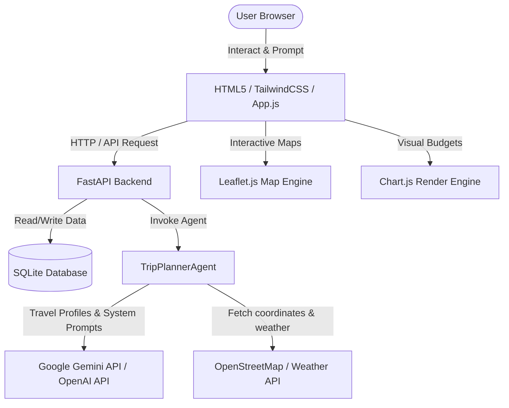

# Sojourn - AI Travel Agent & Trip Planner

Sojourn is a premium generative AI travel planning application that designs personalized day-by-day itineraries, manages trip budgets, maps locations, and suggests weather-aware packing lists.

---

## 🗺️ System Architecture Diagram

Below is a structured flow showing how the frontend, API backend, SQLite storage, and Agentic core interact:



---

## ✨ Features

- **Bespoke Day-by-Day Scheduling**: Generates highly detailed timelines including optimal meals, sightseeing, and hotel bookings tailored to your style.
- **Intelligent Budget & Expenses**: Breaks down projected costs and tracks actual spending with category-wise charts.
- **Interactive Map Explorer**: Visualizes hotels, recommended sights, and restaurants on a fully interactive map using Leaflet.js.
- **Weather-Aware Packing Checklist**: Generates custom packing checklists based on destination forecast, with an interactive add/delete checklist manager.
- **AI Chat Assistant**: A context-aware chat assistant to live-modify your itinerary (e.g., "reduce budget by 15%", "add beach activities").
- **PDF Export / Printing**: Customized print stylesheets to cleanly export a print-friendly version of your itinerary and expenses.

---

## 🛠️ Technology Stack

- **Frontend**: Vanilla HTML5, Javascript (ES6), Custom theme utility system, TailwindCSS CDN, Lucide Icons.
- **Interactive Layers**: Leaflet.js (OpenStreetMap), Chart.js (Data visualizations), Marked.js (Markdown rendering).
- **Backend**: FastAPI (Python), Uvicorn.
- **Storage**: SQLite3.
- **Core AI**: LangChain / Custom LLM bindings (Gemini / OpenAI).

---

## 🚀 Getting Started

### Prerequisites

- Python 3.9 or higher installed.

### Setup Instructions

1. **Clone the Repository**:
   ```bash
   git clone https://github.com/Vedu1630/ai-travel-agent.git
   cd ai-travel-agent
   ```

2. **Create a Virtual Environment**:
   ```bash
   python -m venv venv
   # On Windows:
   venv\Scripts\activate
   # On macOS/Linux:
   source venv/bin/activate
   ```

3. **Install Dependencies**:
   ```bash
   pip install -r requirements.txt
   ```

4. **Environment Variables**:
   Create a `.env` file in the root directory and add your API keys:
   ```env
   GEMINI_API_KEY=your_gemini_api_key_here
   ```

5. **Run the Server**:
   ```bash
   python -m uvicorn api:app --host 127.0.0.1 --port 8000 --reload
   ```
   Open **http://127.0.0.1:8000/** in your browser to view the application.

---

## 📂 Project Structure

```
├── static/
│   ├── index.html        # Main SPA UI structure & templates
│   ├── style.css         # Centralized CSS theme styling & custom layouts
│   └── app.js            # Frontend router, state manager & API clients
├── api.py                # FastAPI HTTP routing & endpoints
├── agent.py              # TripPlannerAgent AI core logic
├── database.py           # SQLite schema definitions & query helpers
├── state.py              # Agent state container definitions
├── tools.py              # Web Search & Weather APIs tools
├── config.py             # System configuration loaders
└── requirements.txt      # Python package dependencies
```
